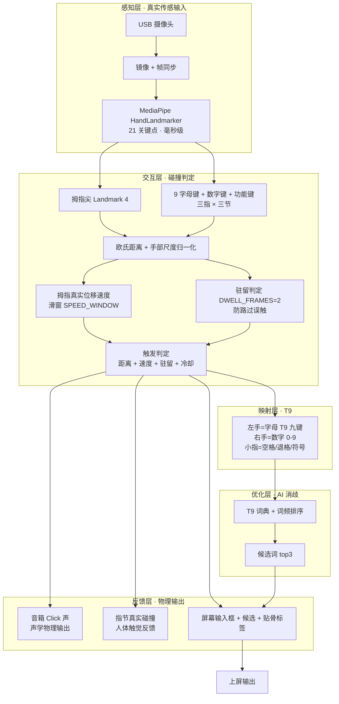

# PalmT9 系统架构图



## 数据流一句话

```
摄像头 → 21 关键点 → 拇指-指节碰撞(距离/速度/驻留) → T9 键值 → 词典消歧 → 候选上屏
                ↘ 命中即响「哒」声 + 指节真实碰撞感（物理输出闭环）
```

## 关键参数

| 参数 | 值 | 作用 |
|---|---|---|
| `REACH_FACTOR` | 无名指近端 1.5 / 远端 1.15 / 小指 1.1-1.2 | 难够的键放宽阈值 |
| `SPEED_MIN` | 0.08（占手部尺度/帧） | 静止挨着不算敲击 |
| `DWELL_FRAMES` | 2 | 路过不触发 |
| `COOLDOWN` | 0.35s | 防连击 |
| `threshold` | 0.34（可 `[ ]` 调） | 基础触发阈值 |
